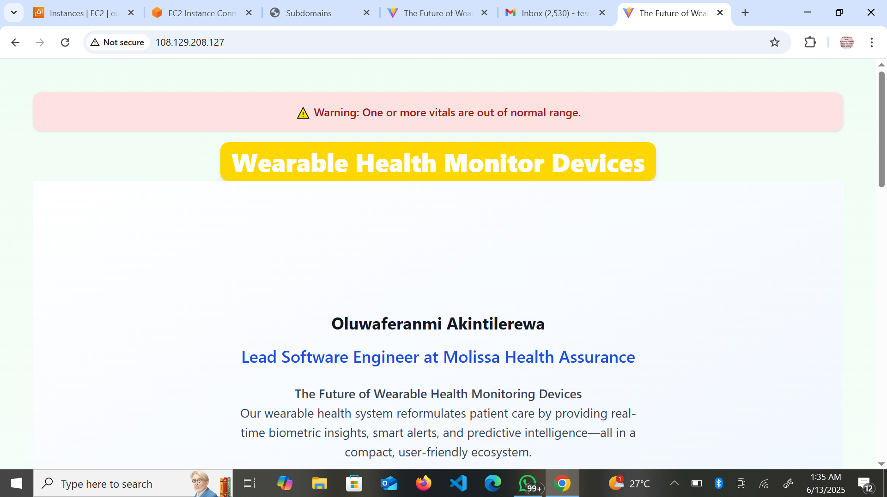

💡 NAME: **OLUWAFERANMI AKINTILEREWA**
STUDENT ID: _ALT/SOE/024/5728_

## PROVISIONING A LINUX SERVER

# CLOUD PROVIDER:AWS

I started by building a simple landing page first inorder to not make my instance run before the time i am navigating to the actual deployment. A little insight on what i did in my landing page is this:

# Project title "The Future of Wearable Monitoring Devices"

I built a responsive, dynamic dashboard that displays vital health metrics from wearable devices. I Built with React, Vite, and Tailwind CSS, it showcases real-time health data, bio, health tips, dark mode support, and a line chart visualization.

## Everything i did

#Vitals Monitoring Dashboard

- Display of Heart Rate, Blood Oxygen, Temperature

- Applied green color to show when vitals are normal and red when in danger.

- Made sure there is timestamp for data freshness

#Danger Alert Banner

- Displays an alert if any vital is out of the normal range

- Supports dark mode for visualization.

#Responsive Line Chart

- Renders heart rate trends over time using Recharts

- Fully responsive via ResponsiveContainer
  My landing page is a brief way to showcase my capabilities of what i will be rendering

## DEPLOYMENT STAGE

    # A Detailed Step To The Deployment

Navigating to EC2 instance, which is my virtual machine on AWS..

# The Settings (server setup)

- I created my instance name which is **progress-server**
- I used Ubuntu 24.04 as my distro, i left it at 64-bit(X86), my instance type is tzmicro.
- I used an existing keypair
- I ensured my SSH traffic to come from my computer's IP address.

# Getting a Domain

Inorder to save time, i proceeded to setting up my free domain as it always take a couple of minutes to get it configured.

- I visited the free DNS site and i signed up for a free domain. In the place of destination while registering, i made my EC2 public IPV4 address as my destination.
- Input my domain, chose my domain, entered the captcha and saved.

# Hosting

After getting an error message after trying to use my EC2 instance to connect, i then proceed to my security group to edit my inbound rules.

- Setting up **http** to **80** and the source to **anywhere ipv4**. **https** to **443** and source to same as http.
- After it has finally connected, i `sudo apt update && sudo apt upgrade` first.
- Next, i installed NGINX using `sudo apt install nginx -y`. To confirm if it was installed, i checked the path using **which nginx**.
- I proceed to copying the IP address at the undersurface of my EC2 instance and paste in my browser to confirm if my web server is up running. Even though the output at this point was the default from nginx.

Inorder to use the reverse proxy:

- I opened the default NGINX site configuration file in the Nano text editor with admin (sudo) access.
  `sudo nano /etc/nginx/sites-available/default`
- I replaced the default server block
- I restarted nginx
  `sudo systemctl restart nginx`
  #App loaded via public IP, react page was served through **nginx**

To get it secured using https

- I then proceed to installing certbot using `sudo apt install certbot -y`
- I installed the plugins with `sudo apt install python-certbot-nginx` then `sudo certbot --nginx` to connect it with **nginx**
- Input my gmail,agreed to the terms and services, agree to sharing my email address with the electronic frontier foundation.
- I entered my domain name **molissa.twilightparadox.com** after giving me a prompt of my account registration.
- connection is now secured at this stage

💡 To clone my projects(landing page)
Using the link in my github(https) to clone my repo

- I cd into my project directory in my github folder

- I installed npm using `sudo apt npm install`
- I built by using `npm run build`
- Installed **vite** after realizing it has not been installed, `npm run build` again
- I pasted my subdomain in my browser and boom there comes my web page
  
  I further pasted my IP address in the browser even though this part was not secured
  

## That was all i did to create my web page and deploy it.
